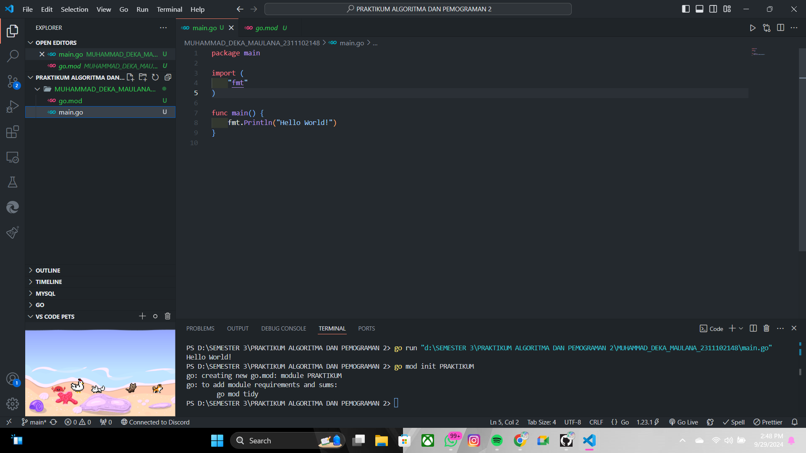

# <h1 align="center">Laporan Praktikum Modul 1 HELLO WORLD!</h1>


<h1 align="center">Muhammad Deka Maulana - 2311102148</h1>

<h2 align="center">PERTEMUAN 1</h2>
<h2 align="center">HELLO WORLD!</h2>

A. Hello World!

### 1. Program Hello World! di Go

```go
package main

import (
    "fmt"
)

func main() {
    fmt.Println("Hello World!")
}

```

### 2. Screenshot Output :


```