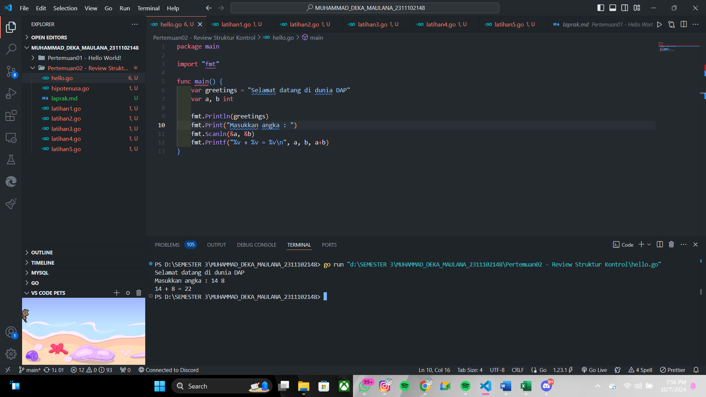
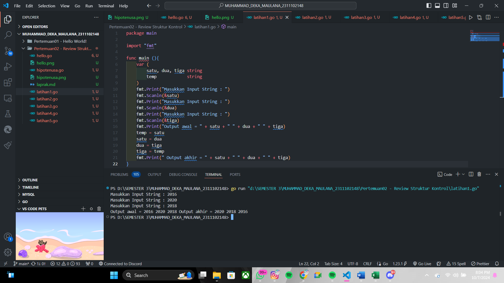
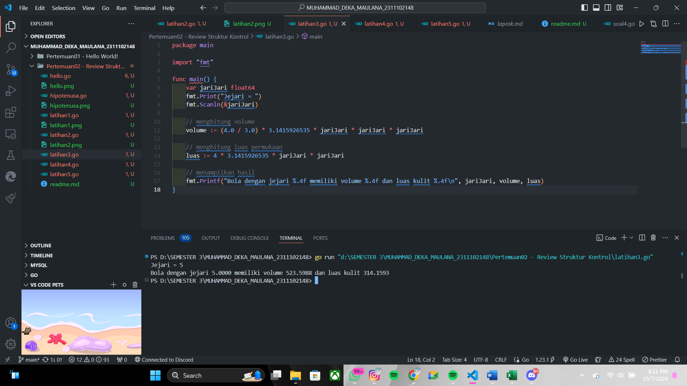
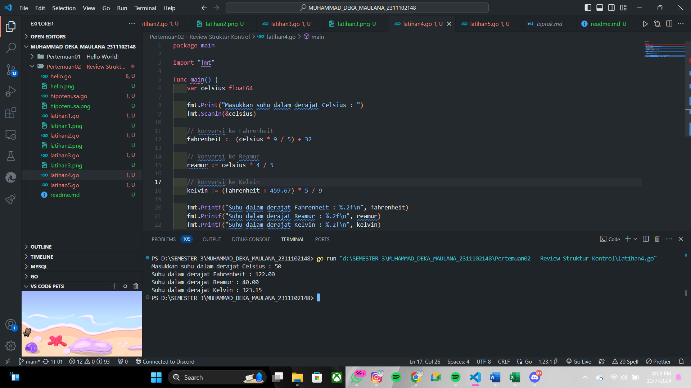
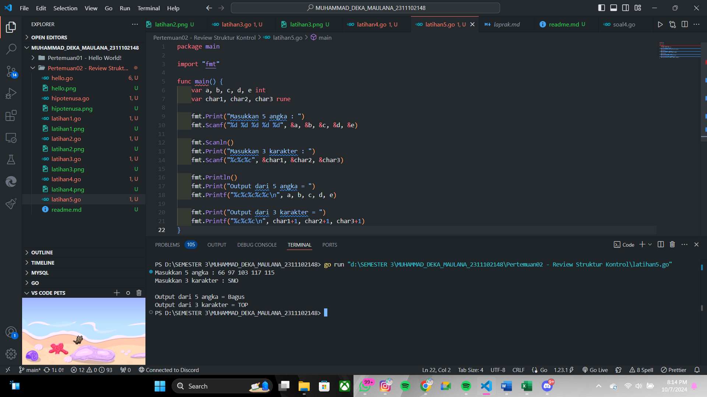

# <h1 align="center">Laporan Praktikum Modul 2 Review Struktur Kontrol!</h1>


<h1 align="center">Muhammad Deka Maulana - 2311102148</h1>

<h2 align="center">PERTEMUAN 2</h2>
<h2 align="center">Review Struktur Kontrol</h2>

### A. Hello World!

```go
package main

import "fmt"

func main() {
	var greetings = "Selamat datang di dunia DAP"
	var a, b int
	
	fmt.Println(greetings)
	fmt.Print("Masukkan angka : ")
	fmt.Scanln(&a, &b)
	fmt.Printf("%v + %v = %v\n", a, b, a+b)
}

```

Screenshot Output :



### B. Hipotenusa

```go
package main

import "fmt"

func main (){
	var a, b, c float64
	var hipotenusa bool
	fmt.Print("Masukkan nilai A ")
	fmt.Scanln(&a)
	fmt.Print("Masukkan nilai B ")
	fmt.Scanln(&b)
	fmt.Print("Masukkan nilai C ")
	fmt.Scanln(&c)
	
	hipotenusa = (c * c) == (a*a + b*b)
	fmt.Println("Sisi c adalah hipotenusa segitiga a, b, dan c : ", hipotenusa)
}

```

Screenshot Output :


### C. Latihan 1

```go

package main

import "fmt"

func main (){
	var (
		satu, dua, tiga string
		temp 			string
	)
	fmt.Print("Masukkan Input String : ")
	fmt.Scanln(&satu)
	fmt.Print("Masukkan Input String : ")
	fmt.Scanln(&dua)
	fmt.Print("Masukkan Input String : ")
	fmt.Scanln(&tiga)
	fmt.Print("Output awal = " + satu + " " + dua + " " + tiga)
	temp = satu
	satu = dua
	dua = tiga
	tiga = temp
	fmt.Print(" Output akhir = " + satu + " " + dua + " " + tiga)
}

```

Screenshot Output :



### D. Latihan 2

```go
package main

import "fmt"

func main(){
	var tahun int

	fmt.Print("Masukkan Tahun : ")
	fmt.Scanln(&tahun)

	if tahun%4==0{
		fmt.Println("Tahun Kabisat : True")
	}else{
		fmt.Println("Tahun Kabisat : False")
	}
}

```

Screenshot Output :


### E. Latihan 3

```go
package main

import "fmt"

func main() {
	var jariJari float64
	fmt.Print("Jejari = ")
	fmt.Scanln(&jariJari)

	// menghitung volume
	volume := (4.0 / 3.0) * 3.1415926535 * jariJari * jariJari * jariJari

	// menghitung luas permukaan
	luas := 4 * 3.1415926535 * jariJari * jariJari

	// menampilkan hasil
	fmt.Printf("Bola dengan jejari %.4f memiliki volume %.4f dan luas kulit %.4f\n", jariJari, volume, luas)
}

```

Screenshot Output :



### F. Latihan 4

```go
package main

import "fmt"

func main() {
    var celsius float64

    fmt.Print("Masukkan suhu dalam derajat Celsius : ")
    fmt.Scanln(&celsius)

    // konversi ke Fahrenheit
    fahrenheit := (celsius * 9 / 5) + 32

    // konversi ke Reamur
    reamur := celsius * 4 / 5

    // konversi ke Kelvin
    kelvin := (fahrenheit + 459.67) * 5 / 9

    fmt.Printf("Suhu dalam derajat Fahrenheit : %.2f\n", fahrenheit)
    fmt.Printf("Suhu dalam derajat Reamur : %.2f\n", reamur)
    fmt.Printf("Suhu dalam derajat Kelvin : %.2f\n", kelvin)
}

```

Screenshot Output :



### G. Latihan 5

```go
package main

import "fmt"

func main() {
	var a, b, c, d, e int
	var char1, char2, char3 rune

	fmt.Print("Masukkan 5 angka : ")
	fmt.Scanf("%d %d %d %d %d", &a, &b, &c, &d, &e)

	fmt.Scanln()
	fmt.Print("Masukkan 3 karakter : ")
	fmt.Scanf("%c%c%c", &char1, &char2, &char3)

	fmt.Println()
	fmt.Print("Output dari 5 angka = ")
	fmt.Printf("%c%c%c%c%c\n", a, b, c, d, e)

	fmt.Print("Output dari 3 karakter = ")
	fmt.Printf("%c%c%c\n", char1+1, char2+1, char3+1)
}

```

Screenshot Output :

