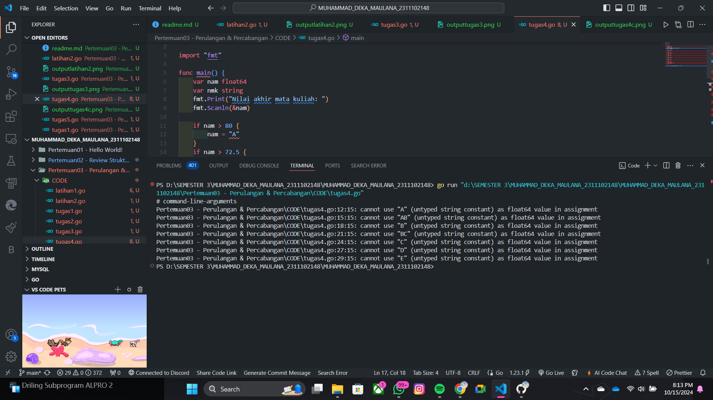

# <h1 align="center">Laporan Praktikum Modul 3 PERULANGAN & PERCABANGAN</h1>

<h1 align="center">Muhammad Deka Maulana - 2311102129</h1>

<h2 align="center">PERTEMUAN 3</h2>
<h2 align="center">PERULANGAN & PERCABANGAN</h2>

### 1. Latihan 1

```go
package main

import "fmt"

func main() {
	urutanBenar := []string{"merah", "kuning", "hijau", "ungu"}
	hasil := true

	for i := 1; i <= 5; i++ {
		var warna1, warna2, warna3, warna4 string
		fmt.Printf("Percobaan %d\n ", i)
		fmt.Print("Masukkan warna pertama : ")
		fmt.Scan(&warna1)
		fmt.Print("Masukkan warna kedua : ")
		fmt.Scan(&warna2)
		fmt.Print("Masukkan warna ketiga : ")
		fmt.Scan(&warna3)
		fmt.Print("Masukkan warna keempat : ")
		fmt.Scan(&warna4)

		if warna1 != urutanBenar[0] || warna2 != urutanBenar[1] || warna3 != urutanBenar[2] || warna4 != urutanBenar[3] {
			hasil = false
		}
	}
	println("BERHASIL", hasil)
}
```

### Screenshot output :


### 2. Latihan 2

```go
package main

import (
	"bufio"
	"fmt"
	"os"
	"strings"
)

func main(){
	scanner := bufio.NewScanner(os.Stdin)
	var pita string
	var bungaCount int

	for{
		fmt.Printf("Bunga %d : ", bungaCount+1)
		scanner.Scan()
		input := scanner.Text()

		if strings.ToLower(input) == "selesai"{
			break
		}

		if pita == ""{
			pita = input
		} else {
			pita += " - " + input
		}
		bungaCount++
	}

	fmt.Printf("Pita : %s\n", pita)
	fmt.Printf("Bunga : %d\n", bungaCount)
}
```

### Screenshot output :


### 3. Tugas 1

```go
package main

import (
	"fmt"
	"math"
)

func main() {
	var kantong1, kantong2 float64
	oleng := false

	for {
		// meminta pengguna utk memasukkan berat belanjaan di kedua kantong
		fmt.Print("Masukkan berat belanjaan di kedua kantong : ")
		fmt.Scan(&kantong1, &kantong2)

		// jika total berat melebihi 150 unit, tampilkan pesan dan akhiri program
		if kantong1+kantong2 > 150 {
			fmt.Println("Berat melebihi 150")
			fmt.Println("Proses selesai.")
			break
		}

		// jika salah satu dari berat bernilai negatif, akhiri program
		if kantong1 < 0 || kantong2 < 0 {
			fmt.Println("Proses selesai.")
			break
		}

		// menghitung selisih absolut antara berat di kedua kantong
		selisih := math.Abs(kantong1 - kantong2)

		// menentukan apakah sepeda motor akan oleng
		// jika selisih lebih dari 9 unit, set `oleng` menjadi true
		oleng = selisih > 9

		// mencetak apakah sepeda motor Pak Andi akan oleng berdasarkan selisih berat di kedua kantong
		fmt.Printf("Sepeda motor pak Andi akan oleng : %v\n", oleng)
	}
}

```

### Screenshot output :


### 4. Tugas 2

```go
package main

import (
	"fmt"
	"math"
)

// Fungsi untuk menghitung f(k)
func f(k float64) float64 {
	pembilang := math.Pow((4*k + 2), 2)
	penyebut := (4*k + 1) * (4*k + 3)
	return pembilang / penyebut
}

func akar2(k int) float64 {
	hasil := 1.0
	for i := 0; i <= k; i++ {
		hasil *= f(float64(i))
	}
	return hasil
}

func main() {
	var K int

	for i := 1; i <= 3; i++ {
		fmt.Print("Nilai K = ")
		fmt.Scan(&K)

		hampiranAkar2 := akar2(K)
		fmt.Printf("Nilai akar 2 = %.10f\n\n", hampiranAkar2)
	}

	fmt.Println("Program selesai!")
}
```

### Screenshot output :


### 5. Tugas 3

```go
package main

import (
	"fmt"
)

// fungsi hitungBiaya menghitung biaya pengiriman berdasarkan berat
func hitungBiaya(berat int) (kg, sisaGram, biayaKg, biayaSisaGram int, biayaDitambahkan bool) {
	const biayaPerKg = 10000
	kg = berat / 1000
	sisaGram = berat % 1000
	biayaKg = kg * biayaPerKg
	biayaDitambahkan = true

	// menggunakan switch utk menentukan apakah biaya sisa gram akan dihitung
	switch {
	case kg >= 10:
		biayaSisaGram = sisaGram * 5
		biayaDitambahkan = false
	case sisaGram >= 500:
		biayaSisaGram = sisaGram * 5
	default:
		biayaSisaGram = sisaGram * 15
	}

	return
}

// fungsi tampilkanBiaya mencetak hasil perhitungan biaya
func tampilkanBiaya(berat int) {
	kg, sisaGram, biayaKg, biayaSisaGram, biayaDitambahkan := hitungBiaya(berat)
	totalBiaya := biayaKg
	if biayaDitambahkan {
		totalBiaya += biayaSisaGram
	}

	// mencetak hasil detail perhitungan
	fmt.Printf("Detail berat : %d kg + %d gr\n", kg, sisaGram)
	fmt.Printf("Detail biaya : Rp. %d + Rp. %d\n", biayaKg, biayaSisaGram)
	fmt.Printf("Total biaya : Rp. %d\n\n", totalBiaya)
}

func main() {
	// loop untuk menerima input dari user sebanyak 3 kali
	for i := 1; i <= 3; i++ {
		var berat int
		fmt.Printf("Contoh #%d :\n", i)
		fmt.Print("Berat parsel (gram) : ")
		fmt.Scan(&berat)
		tampilkanBiaya(berat)
	}
}

```

### Screenshot output :


### 6. Tugas 4a

```go
// sebelum diperbaiki
package main

import "fmt"

func main() {
    var nam float64
    var nmk string
    fmt.Print("Nilai akhir mata kuliah: ")
    fmt.Scanln(&nam)

    if nam > 80 {
        nam = "A"
    }
    if nam > 72.5 {
        nam = "AB"
    }
    if nam > 65 {
        nam = "B"
    }
    if nam > 57.5 {
        nam = "BC"
    }
    if nam > 50 {
        nam = "C"
    }
    if nam > 40 {
        nam = "D"
    } else if nam <= 40 {
        nam = "E"
    }

    fmt.Println("Nilai mata kuliah: ", nmk)
}
```

### Screenshot output :


Jawaban : Program error karena ada kesalahan pada code tersebut.

### 6. Tugas 4b

A. Jika nilai yang diberikan adalah 80.1, program akan memberikan hasil A. Ini karena dalam aturan program, semua nilai di atas 80 otomatis mendapat nilai A.
Jika soal ingin memberikan nilai AB untuk 80.1, maka program perlu diubah. Namun, dengan aturan yang ada, hasilnya sudah benar sesuai dengan program yang dibuat.

B. a. Penggunaan variabel yang salah
- Dalam beberapa baris seperti 
```
nam = "A"
```
Variabel nam (yang seharusnya menyimpan nilai angka) diubah menjadi string ("A", "B", dst.). Ini salah karena nam adalah variabel bertipe float64 yang seharusnya hanya berisi angka. Sebaliknya, variabel nmk (yang digunakan untuk menyimpan nilai huruf) harus diisi dengan nilai seperti "A", "B", "C", bukan nam.

b. Tidak menggunakan struktur if-else dengan benar
- Program saat ini menggunakan beberapa blok if terpisah untuk mengevaluasi nilai. Akibatnya, meskipun nilai nam sudah memenuhi syarat untuk kondisi pertama, program akan terus mengevaluasi kondisi berikutnya. Ini akan menyebabkan nilai akhir ditimpa oleh kondisi terakhir yang cocok.
- Misalnya, jika nilai nam adalah 85, program pertama kali akan menetapkan "A", tapi kemudian akan memeriksa kondisi berikutnya seperti "AB", "B", dst., dan akhirnya nilai huruf bisa berubah tanpa sengaja.

c. Kondisi tidak saling eksklusif
- Tidak ada else if yang mencegah evaluasi kondisi setelah nilai yang tepat ditemukan. Dengan hanya menggunakan if, semua kondisi bisa dievaluasi, yang menyebabkan hasil tidak akurat.

#### Alur Program seharusnya
a. Baca nilai akhir (numerik) dari input pengguna ke dalam variabel nam.
b. Cek nilai menggunakan struktur if-else if yang memastikan hanya satu kondisi yang terpenuhi :
- Jika nam > 80, tetapkan nmk = "A".
- Jika nam > 72.5 (dan tidak lebih dari 80), tetapkan nmk = "AB".
- Dan seterusnya untuk nilai lainnya.
c. Cetak nilai huruf berdasarkan variabel nmk.

### 7. Tugas 4c

```go
// setelah diperbaiki
package main

import "fmt"

func main() {
	var nam float64
	var nmk string

	// Input nilai akhir matakuliah
	fmt.Print("Nilai akhir mata kuliah : ")
	fmt.Scanln(&nam)

	// Grade berdasarkan nilai
	if nam > 80 {
		nmk = "A"
	} else if nam > 72.5 {
		nmk = "AB"
	} else if nam > 65 {
		nmk = "B"
	} else if nam > 57.5 {
		nmk = "BC"
	} else if nam > 50 {
		nmk = "C"
	} else if nam > 40 {
		nmk = "D"
	} else {
		nmk = "E"
	}

	// print nmk
	fmt.Println("Nilai mata kuliah : ", nmk)
}
```

### Screenshot output :


### 8. Tugas 5

```go
package main

import "fmt"

func main() {
	for i := 1; i <= 2; i++ {
		var b int
		fmt.Printf("Bilangan ke-%d : ", i)
		fmt.Scan(&b)

		// Cetak faktor
		fmt.Print("Faktor : ")
		jumlahFaktor := 0
		for j := 1; j <= b; j++ {
			if b%j == 0 {
				fmt.Printf("%d ", j)
				jumlahFaktor++
			}
		}
		fmt.Println()

		// Cek apakah prima
		fmt.Printf("Prima : %t\n\n", jumlahFaktor == 2)
	}

	fmt.Println("Program selesai!")
}
```

### Screenshot output :

