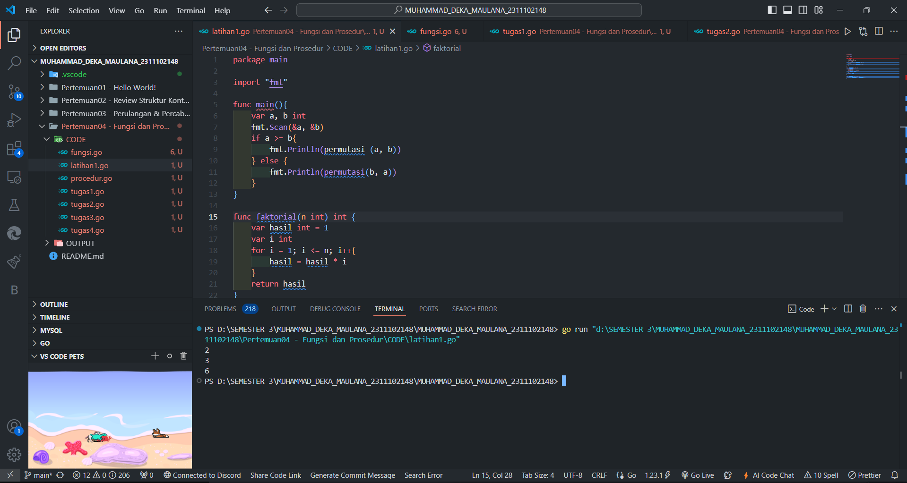
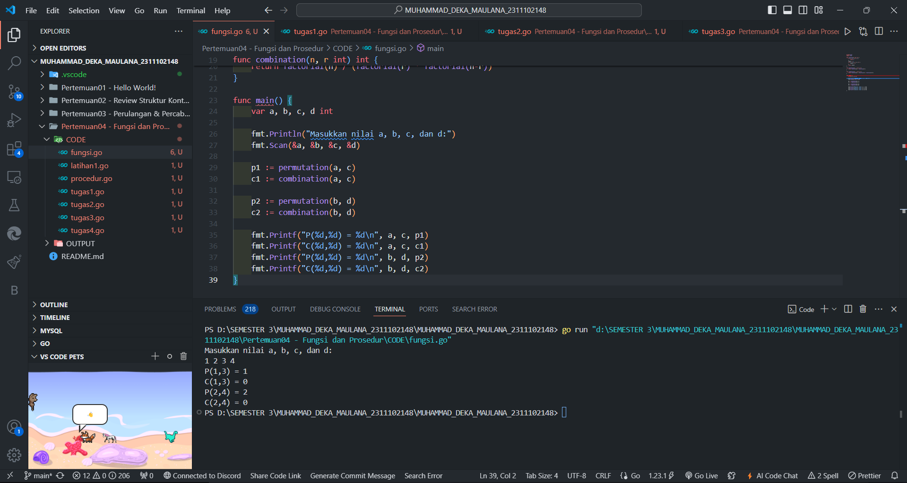
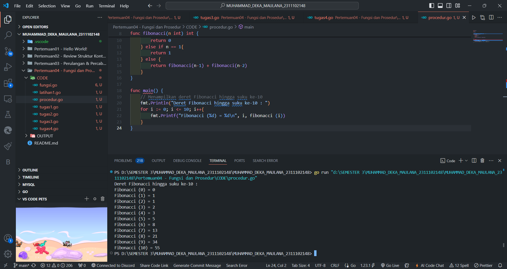
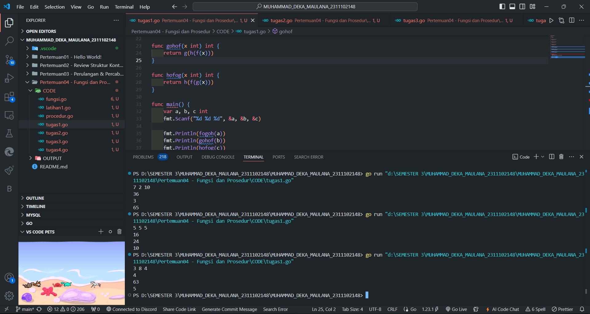
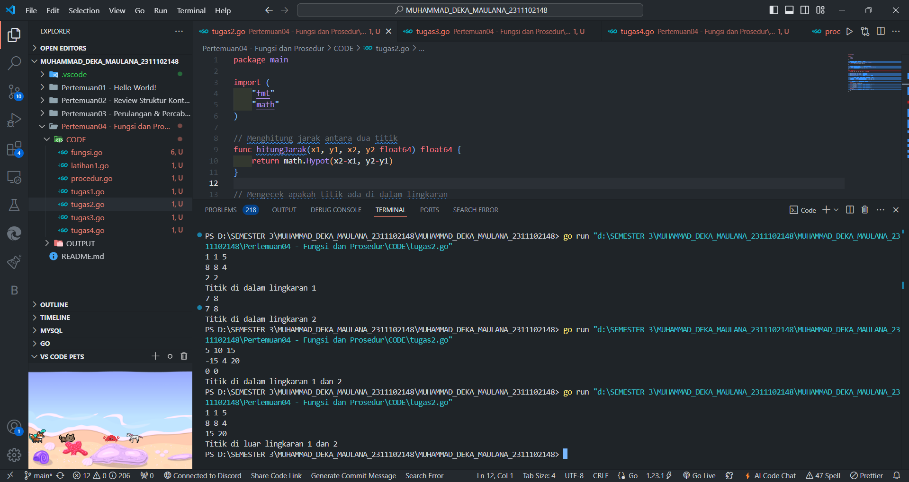
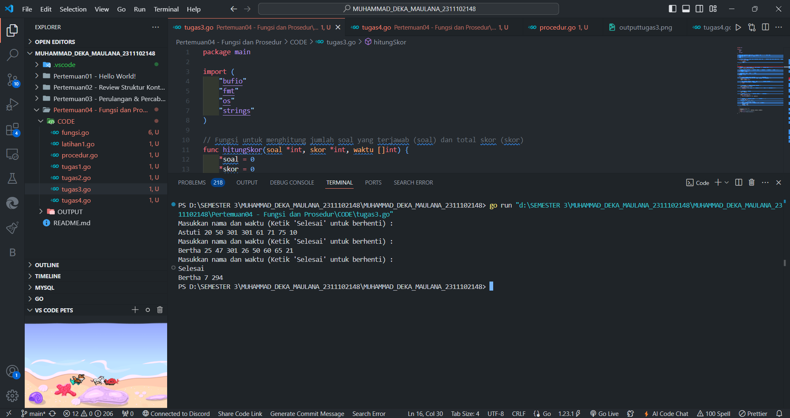
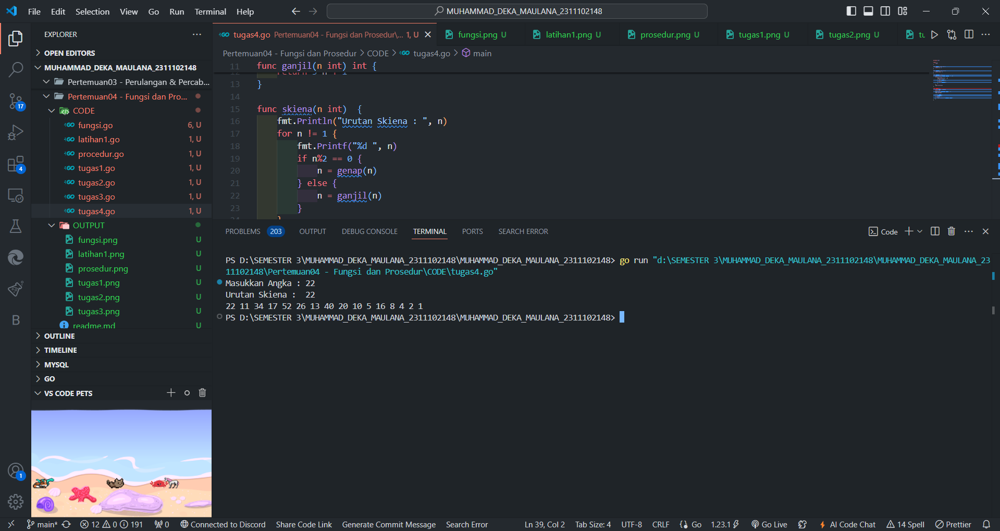

# <h1 align="center">Laporan Praktikum Modul 3 & 4 FUNGSI DAN PROSEDUR</h1>

<h1 align="center">Muhammad Deka Maulana - 2311102148</h1>

<h2 align="center">PERTEMUAN 4</h2>
<h2 align="center">FUNGSI & PROSEDUR</h2>

### A. Bilangan Faktorial dan Permutasi

```go
package main

import "fmt"

func main(){
	var a, b int
	fmt.Scan(&a, &b)
	if a >= b{
		fmt.Println(permutasi (a, b))
	} else {
		fmt.Println(permutasi(b, a))
	}
}

func faktorial(n int) int {
	var hasil int = 1
	var i int
	for i = 1; i <= n; i++{
		hasil = hasil * i
	}
	return hasil
}

func permutasi (n, r int) int {
	return faktorial(n) / faktorial(n-r)
}
```

### Screenshot output :



### B. Bilangan Faktorial, Permutasi, dan Kombinasi

```go
package main
import "fmt"

func factorial(n int) int {
	if n == 0 || n == 1 {
		return 1
	}
	result := 1
	for i := 2; i <= n; i++ {
		result *= i
	}
	return result
}

func permutation(n, r int) int {
	return factorial(n) / factorial(n-r)
}

func combination(n, r int) int {
	return factorial(n) / (factorial(r) * factorial(n-r))
}

func main() {
	var a, b, c, d int

	fmt.Println("Masukkan nilai a, b, c, dan d:")
	fmt.Scan(&a, &b, &c, &d)

	p1 := permutation(a, c)
	c1 := combination(a, c)

	p2 := permutation(b, d)
	c2 := combination(b, d)

	fmt.Printf("P(%d,%d) = %d\n", a, c, p1)
	fmt.Printf("C(%d,%d) = %d\n", a, c, c1)
	fmt.Printf("P(%d,%d) = %d\n", b, d, p2)
	fmt.Printf("C(%d,%d) = %d\n", b, d, c2)
}
```

### Screenshot output :



### C. Fibonacci

```go
package main

import (
	"fmt"
)

// Fungsi rekursif unutk menhitung deret Fibonacci
func fibonacci(n int) int {
	if n == 0{
		return 0
	} else if n == 1{
		return 1
	} else {
		return fibonacci(n-1) + fibonacci(n-2)
	}
}

func main() {
	// Menampilkan deret Fibonacci hingga suku ke-10
	fmt.Println("Deret Fibonacci hingga suku ke-10 : ")
	for i := 0; i <= 10; i++{
		fmt.Printf("Fibonacci (%d) = %d\n", i, fibonacci (i))
	}
}
```

### Screenshot output :



### 1. Modul 3 No. 2 (Fungsi FoGoH, GoFoH, HoFoG)

```go
package main

import (
	"fmt"
)

func f(x int) int {
	return x * x
}

func g(x int) int {
	return x - 2
}

func h(x int) int {
	return x + 1
}

func fogoh(x int) int {
	return f(g(h(x)))
}

func gohof(x int) int {
	return g(h(f(x)))
}

func hofog(x int) int {
	return h(f(g(x)))
}

func main() {
	var a, b, c int
	fmt.Scanf("%d %d %d", &a, &b, &c)

	fmt.Println(fogoh(a))
	fmt.Println(gohof(b))
	fmt.Println(hofog(c))
}

```

### Screenshot output :



### 2. Modul 3 No. 3 (Lingkaran)

```go
package main

import (
	"fmt"
	"math"
)

// Menghitung jarak antara dua titik
func hitungJarak(x1, y1, x2, y2 float64) float64 {
	return math.Hypot(x2-x1, y2-y1)
}

// Mengecek apakah titik ada di dalam lingkaran
func titikDiDalamLingkaran(x, y, cx, cy, r float64) bool {
	return hitungJarak(x, y, cx, cy) <= r
}

func main() {
	var x1, y1, r1, x2, y2, r2, x, y float64

	fmt.Scan(&x1, &y1, &r1) // Lingkaran 1
	fmt.Scan(&x2, &y2, &r2) // Lingkaran 2
	fmt.Scan(&x, &y)        // Titik yang akan dicek

	// Cek apakah titik berada dalam lingkaran 1 atau 2
	diDalam1 := titikDiDalamLingkaran(x, y, x1, y1, r1)
	diDalam2 := titikDiDalamLingkaran(x, y, x2, y2, r2)

	// Tentukan output berdasarkan posisi titik
	switch {
	case diDalam1 && diDalam2:
		fmt.Println("Titik di dalam lingkaran 1 dan 2")
	case diDalam1:
		fmt.Println("Titik di dalam lingkaran 1")
	case diDalam2:
		fmt.Println("Titik di dalam lingkaran 2")
	default:
		fmt.Println("Titik di luar lingkaran 1 dan 2")
	}
}

```

### Screenshot output :



### 3. Modul 4 No. 2 (Lomba)

```go
package main

import (
	"bufio"
	"fmt"
	"os"
	"strings"
)

// Fungsi untuk menghitung jumlah soal yang terjawab (soal) dan total skor (skor)
func hitungSkor(soal *int, skor *int, waktu []int) {
	*soal = 0
	*skor = 0
	
	// Iterasi melalui slice waktu untuk menghitung jumlah soal yang terjawab dalam waktu kurang dari 301 detik
	for _, w := range waktu {
		if w < 301 {
			(*soal)++
			*skor += w
		}
	}
}

func main() {
	// Membuat scanner untuk membaca input dari standar input (biasanya dari keyboard)
	scanner := bufio.NewScanner(os.Stdin)
	
	// Variabel untuk menyimpan nama pemenang, jumlah soal maksimum yang terjawab, dan waktu minimum
	var pemenang string
	var maxSoal, minWaktu int
	
	// Inisialisasi nilai maxSoal dan minWaktu
	maxSoal = 0
	minWaktu = 999999

	for {
		// Meminta pengguna untuk memasukkan nama dan waktu pengerjaan soal
		fmt.Println("Masukkan nama dan waktu (Ketik 'Selesai' untuk berhenti) : ")
		scanner.Scan()
		input := scanner.Text()

		// Jika pengguna mengetik "Selesai", maka program akan berhenti menerima input
		if strings.ToLower(input) == "selesai" {
			break
		}

		// Memisahkan input menjadi potongan-potongan data
		data := strings.Fields(input)
		if len(data) != 9 {
			fmt.Println("Input tidak valid, masukkan nama dan 8 nilai waktu pengerjaan soal.")
			continue
		}

		// Menyimpan nama peserta
		nama := data[0]
		
		// Membuat slice waktu untuk menyimpan delapan waktu pengerjaan soal
		waktu := make([]int, 8)
		for i := 0; i < 8; i++ {
			fmt.Sscanf(data[i+1], "%d", &waktu[i])
		}

		// Variabel untuk menyimpan jumlah soal yang terjawab dan skor
		var soal, skor int
		hitungSkor(&soal, &skor, waktu)

		// Logika untuk menentukan pemenang
		if soal > maxSoal || (soal == maxSoal && skor < minWaktu) {
			pemenang = nama
			maxSoal = soal
			minWaktu = skor
		}
	}

	// Menampilkan hasil akhir
	if pemenang != "" {
		fmt.Printf("%s %d %d\n", pemenang, maxSoal, minWaktu)
	} else {
		fmt.Println("Tidak ada peserta.")
	}
}

```

### Screenshot output :



### 4. Modul 4 No. 3 (Skiena) 

```go
package main

import (
	"fmt"
)

func genap(n int) int {
	return n / 2
}

func ganjil(n int) int {
	return 3*n + 1
}

func skiena(n int)  {
	fmt.Println("Urutan Skiena : ", n)
	for n != 1 {
		fmt.Printf("%d ", n)
		if n%2 == 0 {
			n = genap(n)
		} else {
			n = ganjil(n)
		}
	}
	fmt.Println(1)
}

func main() {
	const nmax = 1000000
	var n int
	fmt.Print("Masukkan Angka : ")
	fmt.Scan(&n)

	if n < nmax {
		skiena(n)
	} else {
		fmt.Println("N terlalu besar")
	}
}
```

### Screenshot output :


