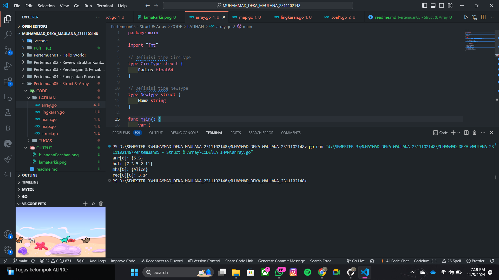

# <h1 align="center">Laporan Praktikum Modul 5 FUNGSI DAN PROSEDUR</h1>

<h1 align="center">Muhammad Deka Maulana - 2311102148</h1>

<h2 align="center">PERTEMUAN 5</h2>
<h2 align="center">STRUCT & ARRAY</h2>

### 1. Bilangan Pecahan

```go
package main

import "fmt"

type bilangan int
type pecahan float64

func main() {
	var a, b bilangan
	var hasil pecahan
	a = 9
	b = 5
	hasil = pecahan(a) / pecahan(b)
	fmt.Println(hasil)
}
```

### Screenshot output :


### 2. Struct (Lama Parkir)

```go
package main
import "fmt"
type waktu struct {
	jam, menit, detik int
}

func main(){
	var wParkir, wPulang, durasi waktu
	var dParkir, dPulang, lParkir int
	fmt.Scan(&wParkir.jam, &wParkir.menit, &wParkir.detik)
	fmt.Scan(&wPulang.jam, &wPulang.menit, &wPulang.detik)
	dParkir = wParkir.detik + wParkir.menit*60 + wParkir.jam*3600
	dPulang = wPulang.detik + wPulang.menit*60 + wPulang.jam*3600
	lParkir = dPulang - dParkir
	durasi.jam = lParkir / 3600
	durasi.menit = lParkir % 3600 / 60
	durasi.detik = lParkir % 3600 % 60
	fmt.Printf("Lama parkir : %d jam %d menit %d detik",
		durasi.jam, durasi.menit, durasi.detik)
}
```

### Screenshot output :


### 3. Array

```go
package main

import "fmt"

// Definisi tipe CircType
type CircType struct {
	Radius float64
}

// Definisi tipe NewType
type NewType struct {
	Name string
}

func main() {
	var (
		// Array arr mempunyai 73 elemen, masing-masing bertipe CircType
		arr [73]CircType

		// Array buf dengan 5 elemen, dengan nilai awal 7,3,5,2,11
		buf = [5]byte{7, 3, 5, 2, 11}

		// Array mhs berisi 2000 elemen NewType
		mhs [2000]NewType

		// Array dua dimensi rec berisi nilai float64
		rec [20][40]float64
	)

	// Mengisi beberapa elemen contoh
	arr[0] = CircType{Radius: 5.5}
	mhs[0] = NewType{Name: "Alice"}
	rec[0][0] = 3.14

	// Contoh penggunaan variabel
	fmt.Println("arr[0]:", arr[0])
	fmt.Println("buf:", buf)
	fmt.Println("mhs[0]:", mhs[0])
	fmt.Println("rec[0][0]:", rec[0][0])
}
```

### Screenshot output :



### 4. Map

```go
package main

import "fmt"

func main() {
	// Membuat map dengan tipe string sebagai kunci dan integer sebagai nilai
	scores := map[string]int{
		"John": 90,
		"Anne": 85,
	}

	// Mengambil nilai dari kunci
	johnScore := scores["John"]
	fmt.Println("Nilai John:", johnScore)

	// Mengganti nilai dari kunci yang ada
	scores["John"] = 95
	fmt.Println("Nilai John setelah diganti:", scores["John"])

	// Menambah kunci baru dengan nilai
	scores["David"] = 88
	fmt.Println("Nilai David ditambahkan:", scores["David"])

	// Menghapus kunci dari map
	delete(scores, "Anne")
	fmt.Println("Map setelah kunci 'Anne' dihapus:", scores)

	// Mengecek apakah kunci ada dalam map
	if score, ada := scores["David"]; ada {
		fmt.Println("Nilai David ditemukan:", score)
	} else {
		fmt.Println("Nilai David tidak ditemukan")
	}
}
```

### Screenshot output :


### 5. Lingkaran

```go
package main

import (
	"fmt"
	"math"
)

// Definisi tipe bentukan untuk titik
type Titik struct {
	x int
	y int
}

// Definisi tipe bentukan untuk lingkaran
type Lingkaran struct {
	center Titik
	radius int
}

// Fungsi untuk menghitung jarak antara dua titik
func jarak(p Titik, q Titik) float64 {
	return math.Sqrt(float64((p.x-q.x)*(p.x-q.x) + (p.y-q.y)*(p.y-q.y)))
}

// Fungsi untuk menentukan apakah titik berada di dalam lingkaran
func didalam(c Lingkaran, p Titik) bool {
	return jarak(p, c.center) < float64(c.radius)
}

func main() {
	var (
		// Mengambil input untuk lingkaran 1
		lingkaran1 Lingkaran
		// Mengambil input untuk lingkaran 2
		lingkaran2 Lingkaran
		// Mengambil input untuk titik sembarang
		point Titik
	)

	// Input untuk lingkaran 1 (cx, cy, r)
	fmt.Println("Masukkan koordinat titik pusat dan radius lingkaran 1 (cx cy r) : ")
	fmt.Scan(&lingkaran1.center.x, &lingkaran1.center.y, &lingkaran1.radius)

	// Input untuk lingkaran 2 (cx, cy, r)
	fmt.Println("Masukkan koordinat titik pusat dan radius lingkaran 2 (cx cy r) : ")
	fmt.Scan(&lingkaran2.center.x, &lingkaran2.center.y, &lingkaran2.radius)

	// Input untuk titik sembarang (x, y)
	fmt.Println("Masukkan koordinat titik sembarang (x y):")
	fmt.Scan(&point.x, &point.y)

	// Mengecek posisi titik terhadap kedua lingkaran
	inLingkaran1 := didalam(lingkaran1, point)
	inLingkaran2 := didalam(lingkaran2, point)

	if inLingkaran1 && inLingkaran2 {
		fmt.Println("Titik di dalam lingkaran 1 dan 2")
	} else if inLingkaran1 {
		fmt.Println("Titik di dalam lingkaran 1")
	} else if inLingkaran2 {
		fmt.Println("Titik di dalam lingkaran 2")
	} else {
		fmt.Println("Titik di luar lingkaran 1 dan 2")
	}
}

```

### Screenshot output :


### 1. Soal 1

```go
package main

import (
	"fmt"
	"math"
)

func main() {
	var n int
	fmt.Print("Masukkan jumlah elemen array (N) : ")
	fmt.Scanln(&n)

	array := make([]int, n) // membuat array dengan panjang n
	for i := 0; i < n; i++ {
		fmt.Printf("Masukkan elemen ke-%d : ", i) // minta input utk setiap elemen array
		fmt.Scanln(&array[i]) // membaca elemen array
	}

	var choice, x, index int
	for {
		// menu
		fmt.Println("\nMenu:")
		fmt.Println("1. Menampilkan keseluruhan isi dari array.")
		fmt.Println("2. Menampilkan elemen-elemen array dengan indeks ganjil saja.")
		fmt.Println("3. Menampilkan elemen-elemen array dengan indeks genap saja.")
		fmt.Println("4. Menampilkan elemen-elemen array dengan indeks kelipatan bilangan x.")
		fmt.Println("5. Menghapus elemen array pada indeks tertentu.")
		fmt.Println("6. Menampilkan rata-rata dari bilangan yang ada di dalam array.")
		fmt.Println("7. Menampilkan standar deviasi dari bilangan yang ada di dalam array.")
		fmt.Println("8. Menampilkan frekuensi dari setiap bilangan tertentu di dalam array.")
		fmt.Println("0. Keluar")
		fmt.Print("Pilih opsi: ")
		fmt.Scanln(&choice)

		switch choice {
		case 1:
			// menampilkan semua elemen array
			fmt.Println("Isi array :", array)

		case 2:
			// menampilkan elemen dengan indeks ganjil
			fmt.Print("Elemen dengan indeks ganjil : ")
			for i := 1; i < len(array); i += 2 {
				fmt.Print(array[i], " ")
			}
			fmt.Println()

		case 3:
			// menampilkan elemen dengan indeks genap
			fmt.Print("Elemen dengan indeks genap : ")
			for i := 0; i < len(array); i += 2 {
				fmt.Print(array[i], " ")
			}
			fmt.Println()

		case 4:
			fmt.Print("Masukkan nilai x : ")
			fmt.Scanln(&x)
			fmt.Printf("Elemen dengan indeks kelipatan %d : ", x)
			for i := x; i < len(array); i += x { // iterasi elemen dengan indeks kelipatan x
				fmt.Print(array[i], " ")
			}
			fmt.Println()

		case 5:
			// menghapus elemen pada indeks tertentu
			fmt.Print("Masukkan indeks yang ingin dihapus : ")
			fmt.Scanln(&index)
			if index >= 0 && index < len(array) { // validasi indeks
				array = append(array[:index], array[index+1:]...) // menghapus elemen dengan menggunakan slicing
				fmt.Println("Isi array setelah penghapusan :", array)
			} else {
				fmt.Println("Indeks tidak valid!") // pesan jika indeks diluar jangkauan
			}

		case 6:
			// menghitung rata-rata elemen array
			total := 0
			for _, value := range array {
				total += value
			}
			avg := float64(total) / float64(len(array)) // rata-rata dihitung sebagai total dibagi jumlah elemen
			fmt.Printf("Rata-rata dari array : %.2f\n", avg)

		case 7:
			// menghitung standar deviasi
			total := 0
			for _, value := range array {
				total += value
			}
			mean := float64(total) / float64(len(array))
			variance := 0.0
			for _, value := range array {
				variance += math.Pow(float64(value)-mean, 2)
			}
			stdDev := math.Sqrt(variance / float64(len(array)))
			fmt.Printf("Standar deviasi dari array : %.2f\n", stdDev)

		case 8:
			// menampilkan frekuensi setiap bilangan
			frequency := make(map[int]int) // map untuk menyimpan frekuensi elemen
			for _, value := range array {
				frequency[value]++ // increment frekuensi untuk setiap elemen
			}
			fmt.Println("Frekuensi setiap bilangan dalam array : ")
			for num, freq := range frequency {
				fmt.Printf("%d : %d kali\n", num, freq)
			}

		case 0:
			fmt.Println("Terima kasih!")
			return

		default:
			fmt.Println("Pilihan tidak valid, silakan coba lagi.")
		}
	}
}

```

### Screenshot output :

.png)
.png)
.png)
.png)
.png)
.png)
.png)
.png)
.png)

### 2. Soal 2

```go
package main

import (
	"fmt"
)

func main() {
	var clubA, clubB string
	var scoreA, scoreB int
	var numMatches int
	var winners []string

	// meminta pengguna memasukkan nama Klub A
	fmt.Print("Masukkan nama Klub A: ")
	fmt.Scanln(&clubA)
	
	// meminta pengguna memasukkan nama Klub B
	fmt.Print("Masukkan nama Klub B: ")
	fmt.Scanln(&clubB)
	
	// meminta jumlah pertandingan yang akan dimainkan
	fmt.Print("Masukkan jumlah pertandingan: ")
	fmt.Scanln(&numMatches)

	// perulangan utk setiap pertandingan
	for i := 1; i <= numMatches; i++ {
		// memasukkan skor utk Klub A
		fmt.Printf("Pertandingan %d (skor %s): ", i, clubA)
		fmt.Scanln(&scoreA)
		
		// memasukkan skor utk Klub B
		fmt.Printf("Pertandingan %d (skor %s): ", i, clubB)
		fmt.Scanln(&scoreB)

		// jika skor negatif dimasukkan, menghentikan input lebih lanjut
		if scoreA < 0 || scoreB < 0 {
			fmt.Println("Pertandingan selesai")
			break
		}

		// menentukan pemenang atau hasil imbang
		if scoreA > scoreB {
			winners = append(winners, clubA)
		} else if scoreB > scoreA {
			winners = append(winners, clubB)
		} else {
			winners = append(winners, "Draw")
		}
	}

	// menampilkan hasil setiap pertandingan
	fmt.Println("\nHasil Pertandingan:")
	for i, winner := range winners {
		if winner == "Draw" {
			fmt.Printf("Hasil %d : Draw\n", i+1)
		} else {
			fmt.Printf("Hasil %d : %s\n", i+1, winner)
		}
	}
	fmt.Println("Pertandingan selesai")
}

```

### Screenshot output :


### 3. Soal 3

```go
package main

import (
	"bufio"
	"fmt"
	"os"
)

const NMAX int = 127

type tabel [NMAX]rune

func isiArray(tab *tabel, n *int) {
	reader := bufio.NewReader(os.Stdin)
	fmt.Print("Masukkan karakter dalam satu baris (akhiri dengan titik '.') : ")
	input, _ := reader.ReadString('\n')

	for i, char := range input {
		if char == '.' || i >= NMAX {
			break
		}
		if char != ' ' && char != '\n' {
			tab[*n] = char
			*n++
		}
	}
}

func cetakArray(tab tabel, n int) {
	for i := 0; i < n; i++ {
		fmt.Printf("%c ", tab[i])
	}
	fmt.Println()
}

func balikkanArray(tab *tabel, n int) {
	for i := 0; i < n/2; i++ {
		tab[i], tab[n-i-1] = tab[n-i-1], tab[i]
	}
}

func palindrom(tab tabel, n int) bool {
	for i := 0; i < n/2; i++ {
		if tab[i] != tab[n-i-1] {
			return false
		}
	}
	return true
}

func main() {
	var tab tabel
	var n int

	isiArray(&tab, &n)

	fmt.Print("Teks: ")
	cetakArray(tab, n)

	if palindrom(tab, n) {
		fmt.Println("Palindrom: true")
	} else {
		fmt.Println("Palindrom: false")
	}

	balikkanArray(&tab, n)
	fmt.Print("Reverse teks: ")
	cetakArray(tab, n)
}
```

### Screenshot output :

