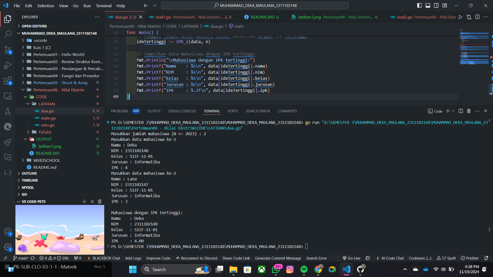
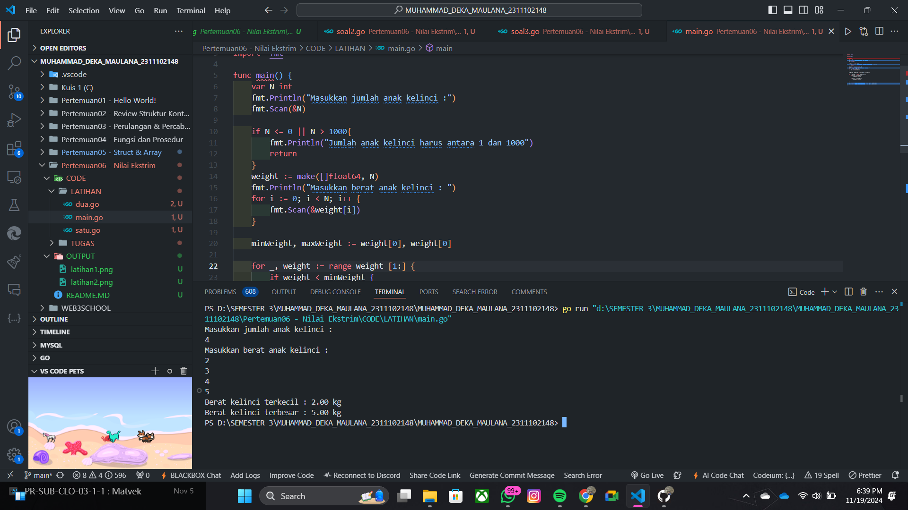
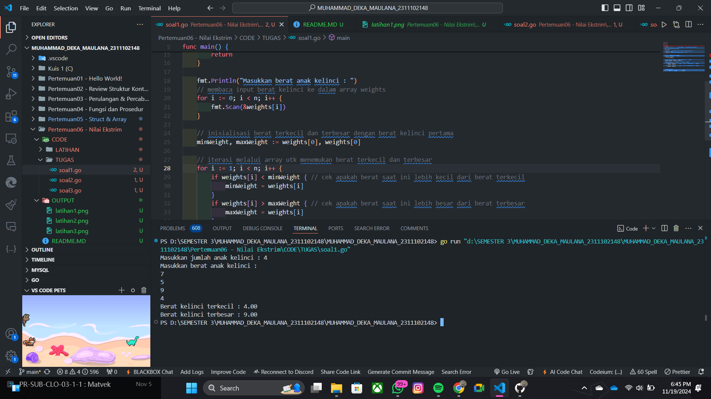
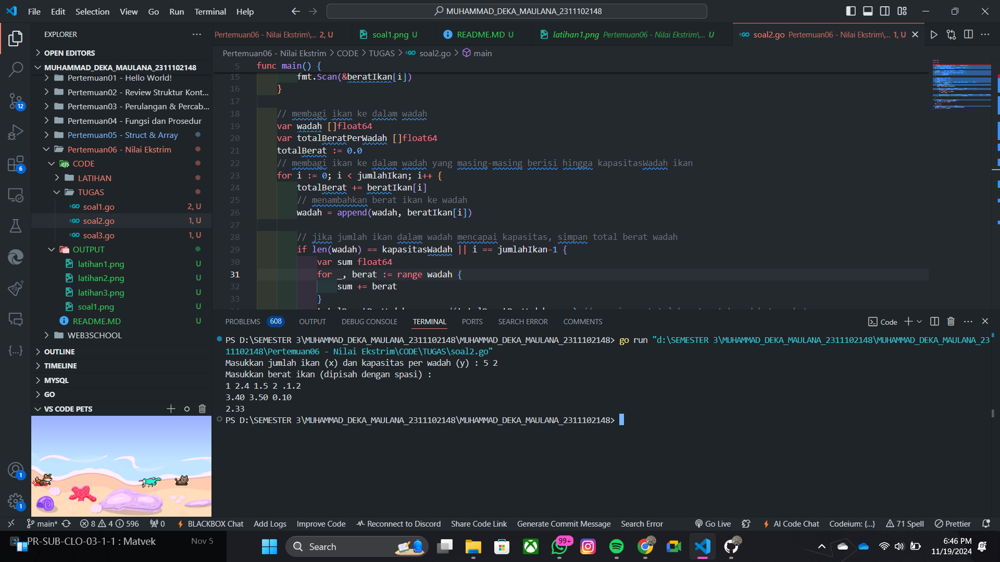
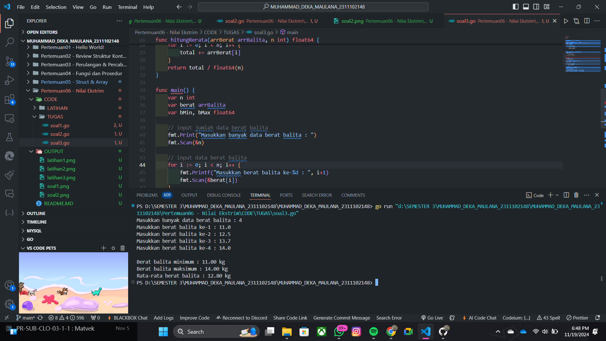

# <h1 align="center">Laporan Praktikum Modul 6 : PENCARIAN NILAI ESKTRIM PADA HIMPUNAN DATA</h1>

<h1 align="center">Muhammad Deka Maulana - 2311102148</h1>

<h2 align="center">PERTEMUAN 6</h2>
<h2 align="center">PENCARIAN NILAI ESKTRIM PADA HIMPUNAN DATA</h2> 

### 1. Latihan 1

```go
package main

import (
	"fmt"
)

type arrInt [2023]int

// Fungsi untuk mencari indeks dari nilai terkecil
func terkecil_2(tabInt arrInt, n int) int {
	var idx int = 0 // indeks data pertama
	var j int = 1   // pencarian dimulai dari data kedua
	for j < n {
		if tabInt[idx] > tabInt[j] { // cek apakah tabInt[j] lebih kecil dari tabInt[idx]
			idx = j // update idx ke indeks baru yang nilainya lebih kecil
		}
		j = j + 1
	}
	return idx // mengembalikan indeks dari nilai terkecil
}

func main() {
	var n int
	var data arrInt

	// Input jumlah elemen N
	fmt.Print("Masukkan jumlah elemen (N <= 2023): ")
	fmt.Scan(&n)

	// Validasi N agar tidak melebihi kapasitas array
	if n <= 0 || n > 2023 {
		fmt.Println("Jumlah elemen harus antara 1 dan 2023")
		return
	}

	// Input elemen-elemen array
	fmt.Println("Masukkan elemen array:")
	for i := 0; i < n; i++ {
		fmt.Scan(&data[i])
	}

	// Panggil fungsi untuk mencari indeks nilai terkecil
	idxTerkecil := terkecil_2(data, n)
	fmt.Printf("Indeks nilai terkecil: %d\n", idxTerkecil)
	fmt.Printf("Nilai terkecil: %d\n", data[idxTerkecil])
}

```

### Output Screenshot:


### 2. Latihan 2

```go
package main

import (
	"fmt"
)

// Mendefinisikan tipe data mahasiswa
type mahasiswa struct {
	nama, nim, kelas, jurusan string
	ipk                       float64
}

// Mendefinisikan array mahasiswa dengan kapasitas 2023
type arrMhs [2023]mahasiswa

// Fungsi untuk mencari indeks mahasiswa dengan IPK tertinggi
func IPK_2(T arrMhs, n int) int {
	// idx menyimpan indeks mahasiswa dengan IPK tertinggi sementara
	var idx int = 0
	var j int = 1
	for j < n {
		if T[idx].ipk < T[j].ipk {
			idx = j
		}
		j = j + 1
	}
	return idx
}

func main() {
	var n int
	var data arrMhs

	// Input jumlah mahasiswa
	fmt.Print("Masukkan jumlah mahasiswa (N <= 2023): ")
	fmt.Scan(&n)

	// Validasi jumlah mahasiswa
	if n <= 0 || n > 2023 {
		fmt.Println("Jumlah mahasiswa harus antara 1 dan 2023")
		return
	}

	// Input data mahasiswa
	for i := 0; i < n; i++ {
		fmt.Printf("Masukkan data mahasiswa ke-%d\n", i+1)
		fmt.Print("Nama: ")
		fmt.Scan(&data[i].nama)
		fmt.Print("NIM: ")
		fmt.Scan(&data[i].nim)
		fmt.Print("Kelas: ")
		fmt.Scan(&data[i].kelas)
		fmt.Print("Jurusan: ")
		fmt.Scan(&data[i].jurusan)
		fmt.Print("IPK: ")
		fmt.Scan(&data[i].ipk)
	}

	// Panggil fungsi untuk mencari indeks mahasiswa dengan IPK tertinggi
	idxTertinggi := IPK_2(data, n)

	// Tampilkan data mahasiswa dengan IPK tertinggi
	fmt.Println("\nMahasiswa dengan IPK tertinggi:")
	fmt.Printf("Nama    : %s\n", data[idxTertinggi].nama)
	fmt.Printf("NIM     : %s\n", data[idxTertinggi].nim)
	fmt.Printf("Kelas   : %s\n", data[idxTertinggi].kelas)
	fmt.Printf("Jurusan : %s\n", data[idxTertinggi].jurusan)
	fmt.Printf("IPK     : %.2f\n", data[idxTertinggi].ipk)
}

```

### Output Screenshot:



### 3. Latihan 3

```go
package main

import "fmt"

func main() {
	var N int
	fmt.Println("Masukkan jumlah anak kelinci :")
	fmt.Scan(&N)

	if N <= 0 || N > 1000{
		fmt.Println("Jumlah anak kelinci harus antara 1 dan 1000")
		return
	}
	weight := make([]float64, N)
	fmt.Println("Masukkan berat anak kelinci : ")
	for i := 0; i < N; i++ {
		fmt.Scan(&weight[i])
	}

	minWeight, maxWeight := weight[0], weight[0]

	for _, weight := range weight [1:] {
		if weight < minWeight {
			minWeight = weight
		}
		if weight > maxWeight {
			maxWeight = weight
		}
	}

	fmt.Printf("Berat kelinci terkecil : %.2f kg\n", minWeight)
	fmt.Printf("Berat kelinci terbesar : %.2f kg\n", maxWeight)
}
```

### Output Screenshot:



### 1. Tugas 1

```go
package main

import "fmt"

func main() {
    var n int
    var weights [1000]float64 // array dengan kapasitas 1000 untuk menampung berat kelinci

    fmt.Print("Masukkan jumlah anak kelinci : ")
    fmt.Scan(&n)

    // validasi input utk memastikan jumlah anak kelinci berada dalam rentang 1-1000
    if n <= 0 || n > 1000 {
        fmt.Println("Jumlah anak kelinci harus antara 1 dan 1000")
        return
    }

    fmt.Println("Masukkan berat anak kelinci : ")
    // membaca input berat kelinci ke dalam array weights
    for i := 0; i < n; i++ {
        fmt.Scan(&weights[i])
    }

    // inisialisasi berat terkecil dan terbesar dengan berat kelinci pertama
    minWeight, maxWeight := weights[0], weights[0]

    // iterasi melalui array utk menemukan berat terkecil dan terbesar
    for i := 1; i < n; i++ {
        if weights[i] < minWeight { // cek apakah berat saat ini lebih kecil dari berat terkecil
            minWeight = weights[i]
        }
        if weights[i] > maxWeight { // cek apakah berat saat ini lebih besar dari berat terbesar
            maxWeight = weights[i]
        }
    }

    // menampilkan hasilny
    fmt.Printf("Berat kelinci terkecil : %.2f\n", minWeight)
    fmt.Printf("Berat kelinci terbesar : %.2f\n", maxWeight)
}

```

### Output Screenshot:



### 2. Tugas 2

```go
package main

import "fmt"

func main() {
	// deklarasi variabel untuk jumlah ikan (x) dan kapasitas wadah (y)
	var jumlahIkan, kapasitasWadah int
	fmt.Print("Masukkan jumlah ikan (x) dan kapasitas per wadah (y) : ")
	fmt.Scan(&jumlahIkan, &kapasitasWadah)

	// membaca input berat ikan menggunakan array kapasitas 1000
	beratIkan := make([]float64, 1000) // kapasitas array 1000
	fmt.Println("Masukkan berat ikan (dipisah dengan spasi) : ")
	for i := 0; i < jumlahIkan; i++ {
		fmt.Scan(&beratIkan[i])
	}

	// membagi ikan ke dalam wadah
	var wadah []float64
	var totalBeratPerWadah []float64
	totalBerat := 0.0
	// membagi ikan ke dalam wadah yang masing-masing berisi hingga kapasitasWadah ikan
	for i := 0; i < jumlahIkan; i++ {
		totalBerat += beratIkan[i]
		// menambahkan berat ikan ke wadah
		wadah = append(wadah, beratIkan[i])

		// jika jumlah ikan dalam wadah mencapai kapasitas, simpan total berat wadah
		if len(wadah) == kapasitasWadah || i == jumlahIkan-1 {
			var sum float64
			for _, berat := range wadah {
				sum += berat
			}
			totalBeratPerWadah = append(totalBeratPerWadah, sum) // menyimpan total berat untuk wadah tersebut
			wadah = []float64{} // reset wadah utk wadah berikutnya
		}
	}

	// menampilkan total berat ikan di setiap wadah
	for _, total := range totalBeratPerWadah {
		fmt.Printf("%.2f ", total)
	}
	fmt.Println()

	// menghitung rata-rata berat ikan di setiap wadah
	rataRata := totalBerat / float64(len(totalBeratPerWadah))
	fmt.Printf("%.2f\n", rataRata)
}

```

### Output Screenshot:



### 3. Tugas 3

```go
package main

import (
	"fmt"
)

// definisi tipe array utk data berat balita
type arrBalita [100]float64

// fungsi utk menghitung berat minimum dan maksimum
func hitungMinMax(arrBerat arrBalita, n int, bMin *float64, bMax *float64) {
	*bMin = arrBerat[0]
	*bMax = arrBerat[0]

	for i := 1; i < n; i++ {
		if arrBerat[i] < *bMin {
			*bMin = arrBerat[i]
		}
		if arrBerat[i] > *bMax {
			*bMax = arrBerat[i]
		}
	}
}

// fungsi utk menghitung rata-rata berat balita
func hitungRerata(arrBerat arrBalita, n int) float64 {
	total := 0.0
	for i := 0; i < n; i++ {
		total += arrBerat[i]
	}
	return total / float64(n)
}

func main() {
	var n int
	var berat arrBalita
	var bMin, bMax float64

	// input jumlah data berat balita
	fmt.Print("Masukkan banyak data berat balita : ")
	fmt.Scan(&n)

	// input data berat balita
	for i := 0; i < n; i++ {
		fmt.Printf("Masukkan berat balita ke-%d : ", i+1)
		fmt.Scan(&berat[i])
	}

	// menghitung minimum, maksimum, dan rata-rata
	hitungMinMax(berat, n, &bMin, &bMax)
	rerata := hitungRerata(berat, n)

	// menampilkan hasil
	fmt.Printf("\nBerat balita minimum : %.2f kg\n", bMin)
	fmt.Printf("Berat balita maksimum : %.2f kg\n", bMax)
	fmt.Printf("Rata-rata berat balita : %.2f kg\n", rerata)
}
```

### Output Screenshot:

