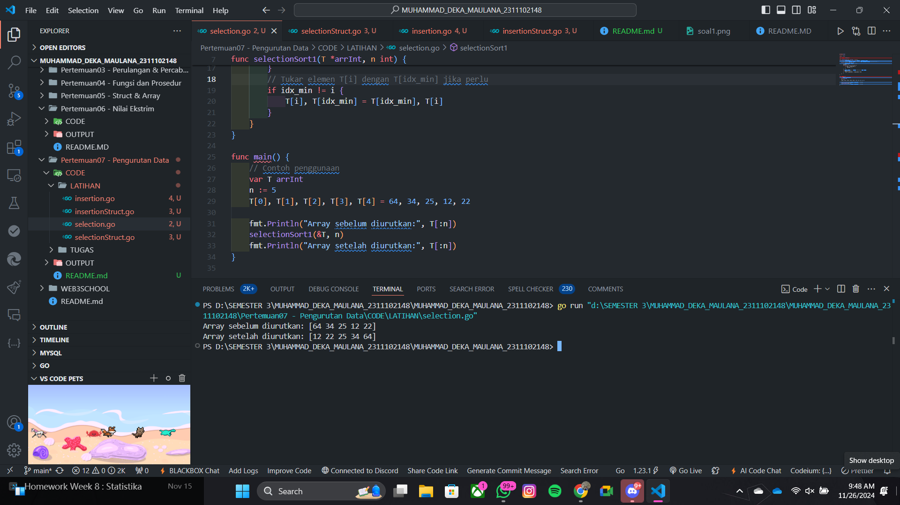
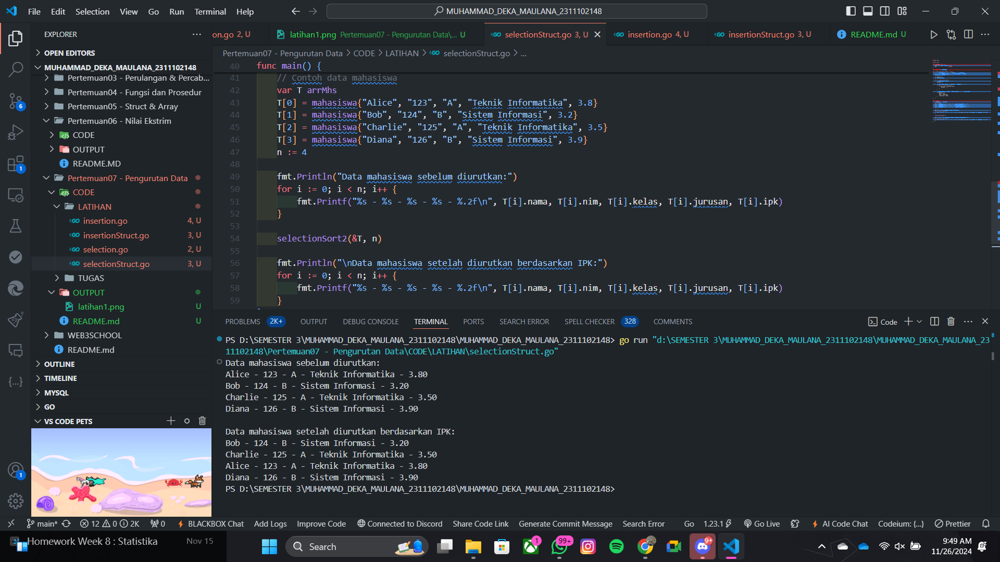
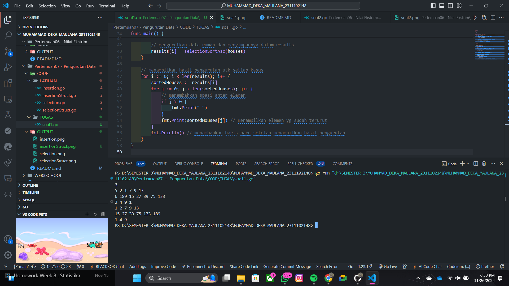
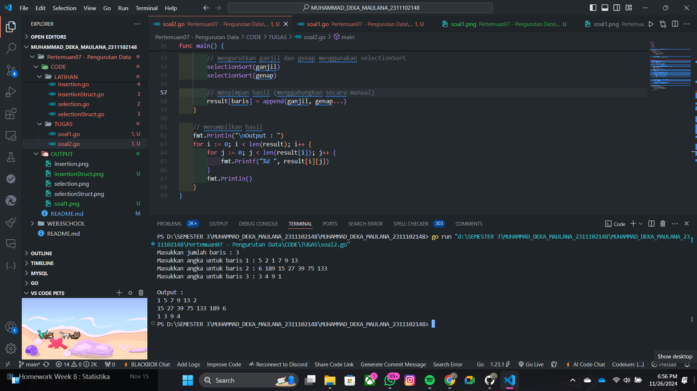
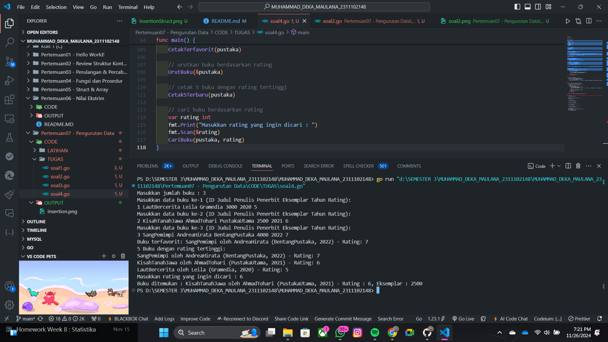

# <h1 align="center">Laporan Praktikum Modul 12 & 13 : PENGURUTAN DATA</h1>

<h1 align="center">Muhammad Deka Maulana - 2311102148</h1>

<h2 align="center">PERTEMUAN 7</h2>
<h2 align="center">PENGURUTAN DATA</h2> 

### 1. Selection

```go
package main

import "fmt"

type arrInt [4321]int

func selectionSort1(T *arrInt, n int) {
	/* I.S. terdefinisi array T yang berisi n bilangan bulat
	   F.S. array T terurut secara ascending atau membesar dengan SELECTION SORT */
	for i := 0; i < n-1; i++ {
		// Inisialisasi indeks minimum
		idx_min := i
		for j := i + 1; j < n; j++ {
			if T[j] < T[idx_min] {
				idx_min = j
			}
		}
		// Tukar elemen T[i] dengan T[idx_min] jika perlu
		if idx_min != i {
			T[i], T[idx_min] = T[idx_min], T[i]
		}
	}
}

func main() {
	// Contoh penggunaan
	var T arrInt
	n := 5
	T[0], T[1], T[2], T[3], T[4] = 64, 34, 25, 12, 22

	fmt.Println("Array sebelum diurutkan:", T[:n])
	selectionSort1(&T, n)
	fmt.Println("Array setelah diurutkan:", T[:n])
}

```

### Output Screenshot:



### 2. Selection Struct

```go
package main

import "fmt"

type mahasiswa struct {
	nama, nim, kelas, jurusan string
	ipk                       float64
}

type arrMhs [2023]mahasiswa

func selectionSort2(T *arrMhs, n int) {
	/* I.S. terdefinisi array T yang berisi n data mahasiswa
	F.S. array T terurut secara ascending berdasarkan ipk dengan
	menggunakan algoritma SELECTION SORT */

	var idx_min int
	var temp mahasiswa

	for i := 0; i < n-1; i++ {
		// Inisialisasi indeks minimum
		idx_min = i

		// Cari elemen dengan IPK terkecil di subarray [i+1, n-1]
		for j := i + 1; j < n; j++ {
			if T[j].ipk < T[idx_min].ipk {
				idx_min = j
			}
		}

		// Tukar elemen di indeks i dengan elemen di idx_min jika perlu
		if idx_min != i {
			temp = T[i]
			T[i] = T[idx_min]
			T[idx_min] = temp
		}
	}
}

func main() {
	// Contoh data mahasiswa
	var T arrMhs
	T[0] = mahasiswa{"Alice", "123", "A", "Teknik Informatika", 3.8}
	T[1] = mahasiswa{"Bob", "124", "B", "Sistem Informasi", 3.2}
	T[2] = mahasiswa{"Charlie", "125", "A", "Teknik Informatika", 3.5}
	T[3] = mahasiswa{"Diana", "126", "B", "Sistem Informasi", 3.9}
	n := 4

	fmt.Println("Data mahasiswa sebelum diurutkan:")
	for i := 0; i < n; i++ {
		fmt.Printf("%s - %s - %s - %s - %.2f\n", T[i].nama, T[i].nim, T[i].kelas, T[i].jurusan, T[i].ipk)
	}

	selectionSort2(&T, n)

	fmt.Println("\nData mahasiswa setelah diurutkan berdasarkan IPK:")
	for i := 0; i < n; i++ {
		fmt.Printf("%s - %s - %s - %s - %.2f\n", T[i].nama, T[i].nim, T[i].kelas, T[i].jurusan, T[i].ipk)
	}
}

```

### Output Screenshot:



### 3. Insertion

```go
package main

import "fmt"

type arrInt [4321]int

func insertionSort1(T *arrInt, n int) {
	/* I.S. terdefinisi array T yang berisi n bilangan bulat
	   F.S. array T terurut secara mengecil (descending) dengan INSERTION SORT */
	var temp, i, j int

	for i = 1; i < n; i++ {
		temp = T[i] // Simpan elemen ke-i
		j = i       // Inisialisasi indeks pembanding

		// Geser elemen-elemen sebelumnya yang lebih kecil dari temp
		for j > 0 && temp > T[j-1] {
			T[j] = T[j-1]
			j--
		}

		// Tempatkan temp pada posisi yang sesuai
		T[j] = temp
	}
}

func main() {
	// Contoh penggunaan
	var T arrInt
	n := 5
	T[0], T[1], T[2], T[3], T[4] = 22, 12, 34, 64, 25

	fmt.Println("Array sebelum diurutkan:", T[:n])
	insertionSort1(&T, n)
	fmt.Println("Array setelah diurutkan secara descending:", T[:n])
}

```

### Output Screenshot:


### 4. Latihan 4

```go

```

### Output Screenshot:


### 1. Tugas 1

```go

```

### Output Screenshot:



### 2. Tugas 2

```go

```

### Output Screenshot:



### 3. Tugas 3

```go

```

### Output Screenshot:


### 4. Tugas 4

```go

```

### Output Screenshot:

