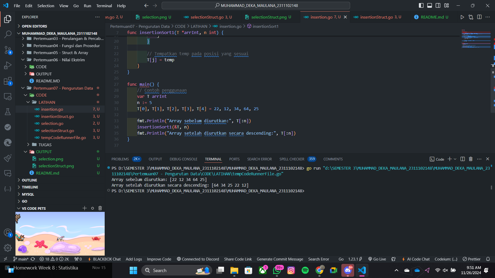
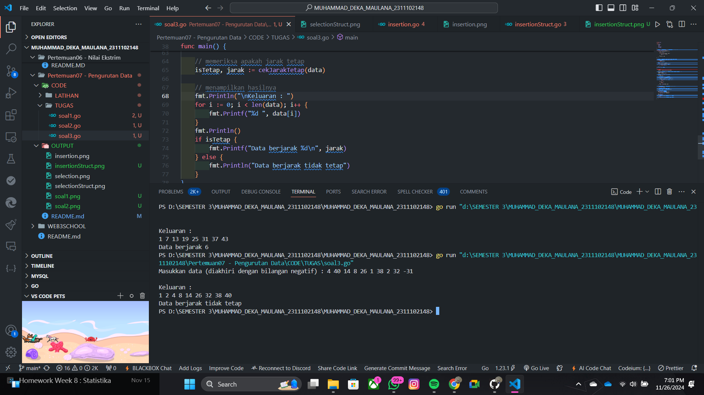

# <h1 align="center">Laporan Praktikum Modul 12 & 13 : PENGURUTAN DATA</h1>

<h1 align="center">Muhammad Deka Maulana - 2311102148</h1>

<h2 align="center">PERTEMUAN 7</h2>
<h2 align="center">PENGURUTAN DATA</h2> 

### 1. Selection

```go
package main

import "fmt"

type arrInt [4321]int

func selectionSort1(T *arrInt, n int) {
	/* I.S. terdefinisi array T yang berisi n bilangan bulat
	   F.S. array T terurut secara ascending atau membesar dengan SELECTION SORT */
	for i := 0; i < n-1; i++ {
		// Inisialisasi indeks minimum
		idx_min := i
		for j := i + 1; j < n; j++ {
			if T[j] < T[idx_min] {
				idx_min = j
			}
		}
		// Tukar elemen T[i] dengan T[idx_min] jika perlu
		if idx_min != i {
			T[i], T[idx_min] = T[idx_min], T[i]
		}
	}
}

func main() {
	// Contoh penggunaan
	var T arrInt
	n := 5
	T[0], T[1], T[2], T[3], T[4] = 64, 34, 25, 12, 22

	fmt.Println("Array sebelum diurutkan:", T[:n])
	selectionSort1(&T, n)
	fmt.Println("Array setelah diurutkan:", T[:n])
}

```

### Output Screenshot:


### 2. Selection Struct

```go
package main

import "fmt"

type mahasiswa struct {
	nama, nim, kelas, jurusan string
	ipk                       float64
}

type arrMhs [2023]mahasiswa

func selectionSort2(T *arrMhs, n int) {
	/* I.S. terdefinisi array T yang berisi n data mahasiswa
	F.S. array T terurut secara ascending berdasarkan ipk dengan
	menggunakan algoritma SELECTION SORT */

	var idx_min int
	var temp mahasiswa

	for i := 0; i < n-1; i++ {
		// Inisialisasi indeks minimum
		idx_min = i

		// Cari elemen dengan IPK terkecil di subarray [i+1, n-1]
		for j := i + 1; j < n; j++ {
			if T[j].ipk < T[idx_min].ipk {
				idx_min = j
			}
		}

		// Tukar elemen di indeks i dengan elemen di idx_min jika perlu
		if idx_min != i {
			temp = T[i]
			T[i] = T[idx_min]
			T[idx_min] = temp
		}
	}
}

func main() {
	// Contoh data mahasiswa
	var T arrMhs
	T[0] = mahasiswa{"Alice", "123", "A", "Teknik Informatika", 3.8}
	T[1] = mahasiswa{"Bob", "124", "B", "Sistem Informasi", 3.2}
	T[2] = mahasiswa{"Charlie", "125", "A", "Teknik Informatika", 3.5}
	T[3] = mahasiswa{"Diana", "126", "B", "Sistem Informasi", 3.9}
	n := 4

	fmt.Println("Data mahasiswa sebelum diurutkan:")
	for i := 0; i < n; i++ {
		fmt.Printf("%s - %s - %s - %s - %.2f\n", T[i].nama, T[i].nim, T[i].kelas, T[i].jurusan, T[i].ipk)
	}

	selectionSort2(&T, n)

	fmt.Println("\nData mahasiswa setelah diurutkan berdasarkan IPK:")
	for i := 0; i < n; i++ {
		fmt.Printf("%s - %s - %s - %s - %.2f\n", T[i].nama, T[i].nim, T[i].kelas, T[i].jurusan, T[i].ipk)
	}
}

```

### Output Screenshot:


### 3. Insertion

```go
package main

import "fmt"

type arrInt [4321]int

func insertionSort1(T *arrInt, n int) {
	/* I.S. terdefinisi array T yang berisi n bilangan bulat
	   F.S. array T terurut secara mengecil (descending) dengan INSERTION SORT */
	var temp, i, j int

	for i = 1; i < n; i++ {
		temp = T[i] // Simpan elemen ke-i
		j = i       // Inisialisasi indeks pembanding

		// Geser elemen-elemen sebelumnya yang lebih kecil dari temp
		for j > 0 && temp > T[j-1] {
			T[j] = T[j-1]
			j--
		}

		// Tempatkan temp pada posisi yang sesuai
		T[j] = temp
	}
}

func main() {
	// Contoh penggunaan
	var T arrInt
	n := 5
	T[0], T[1], T[2], T[3], T[4] = 22, 12, 34, 64, 25

	fmt.Println("Array sebelum diurutkan:", T[:n])
	insertionSort1(&T, n)
	fmt.Println("Array setelah diurutkan secara descending:", T[:n])
}

```

### Output Screenshot:



### 4. Latihan 4

```go
package main

import "fmt"

type mahasiswa struct {
	nama, nim, kelas, jurusan string
	ipk                       float64
}

type arrMhs [2023]mahasiswa

func insertionSort2(T *arrMhs, n int) {
	/* I.S. terdefinisi array T yang berisi n data mahasiswa
	F.S. array T terurut secara mengecil (descending) berdasarkan nama
	dengan menggunakan algoritma INSERTION SORT */
	var temp mahasiswa
	var i, j int

	for i = 1; i < n; i++ {
		temp = T[i] // Simpan elemen ke-i
		j = i       // Inisialisasi indeks pembanding

		// Geser elemen-elemen sebelumnya
		for j > 0 && temp.nama > T[j-1].nama {
			T[j] = T[j-1]
			j--
		}

		// Tempatkan temp pada posisi yang sesuai
		T[j] = temp
	}
}

func main() {
	// Contoh data mahasiswa
	var T arrMhs
	T[0] = mahasiswa{"Charlie", "125", "A", "Teknik Informatika", 3.5}
	T[1] = mahasiswa{"Alice", "123", "A", "Teknik Informatika", 3.8}
	T[2] = mahasiswa{"Bob", "124", "B", "Sistem Informasi", 3.2}
	T[3] = mahasiswa{"Diana", "126", "B", "Sistem Informasi", 3.9}
	n := 4

	fmt.Println("Data mahasiswa sebelum diurutkan:")
	for i := 0; i < n; i++ {
		fmt.Printf("%s - %s - %s - %s - %.2f\n", T[i].nama, T[i].nim, T[i].kelas, T[i].jurusan, T[i].ipk)
	}

	insertionSort2(&T, n)

	fmt.Println("\nData mahasiswa setelah diurutkan berdasarkan nama (descending):")
	for i := 0; i < n; i++ {
		fmt.Printf("%s - %s - %s - %s - %.2f\n", T[i].nama, T[i].nim, T[i].kelas, T[i].jurusan, T[i].ipk)
	}
}

```

### Output Screenshot:


### 1. Tugas 1

```go
package main

import (
	"fmt"
)

// selectionSortAsc adalah fungsi utk mengurutkan array menggunakan algoritma selection sort dalam urutan menaik.
func selectionSortAsc(arr []int) []int {
	n := len(arr) // menyimpan panjang array utk digunakan dalam perulangan
	for i := 0; i < n-1; i++ {
		minIdx := i // menandai indeks elemen terkecil (pada awal adalah elemen pertama)
		// mencari elemen terkecil dalam array yg belum terurut
		for j := i + 1; j < n; j++ {
			if arr[j] < arr[minIdx] {
				minIdx = j // memperbarui indeks jika ditemukan elemen yg lebih kecil
			}
		}
		// menukar elemen yg ditemukan dengan elemen pertama yg belum terurut
		arr[i], arr[minIdx] = arr[minIdx], arr[i]
	}
	return arr // mengembalikan array yg sudah diurutkan
}

func main() {
	var n int
	fmt.Scan(&n) // membaca jumlah data yg akan diproses

	// membuat slice utk menyimpan hasil pengurutan dari setiap kasus
	results := make([][]int, n)

	// loop utk memproses setiap input
	for i := 0; i < n; i++ {
		var m int
		fmt.Scan(&m) // membaca jumlah elemen dalam kasus ini
		houses := make([]int, m) // membuat slice utk menyimpan data rumah

		// membaca setiap data rumah dan memasukkannya ke dalam slice
		for j := 0; j < m; j++ {
			fmt.Scan(&houses[j]) 
		}

		// mengurutkan data rumah dan menyimpannya dalam results
		results[i] = selectionSortAsc(houses)
	}

	// menampilkan hasil pengurutan utk setiap kasus
	for i := 0; i < len(results); i++ {
		sortedHouses := results[i]
		for j := 0; j < len(sortedHouses); j++ {
			// menambahkan spasi antar elemen
			if j > 0 {
				fmt.Print(" ")
			}
			fmt.Print(sortedHouses[j]) // menampilkan elemen yg sudah terurut
		}
		fmt.Println() // menambahkan baris baru setelah menampilkan hasil pengurutan
	}
}

```

### Output Screenshot:


### 2. Tugas 2

```go
package main

import (
	"bufio"
	"fmt"
	"os"
	"strconv"
	"strings"
)

// fungsi selection sort utk mengurutkan slice integer
func selectionSort(arr []int) {
	n := len(arr)
	for i := 0; i < n-1; i++ {
		minIdx := i
		for j := i + 1; j < n; j++ {
			if arr[j] < arr[minIdx] {
				minIdx = j
			}
		}
		// menukar elemen
		arr[i], arr[minIdx] = arr[minIdx], arr[i]
	}
}

func main() {
	var jumlahBaris int
	fmt.Print("Masukkan jumlah baris: ")
	fmt.Scanln(&jumlahBaris)

	scanner := bufio.NewScanner(os.Stdin)
	result := make([][]int, jumlahBaris)

	for baris := 0; baris < jumlahBaris; baris++ {
		fmt.Printf("Masukkan angka untuk baris %d: ", baris+1)
		scanner.Scan()
		input := scanner.Text()

		angkaStr := strings.Fields(input)
		var ganjil []int
		var genap []int

		// memisahkan bilangan ganjil dan genap
		for i := 0; i < len(angkaStr); i++ {
			angka, _ := strconv.Atoi(angkaStr[i])
			if angka%2 == 0 {
				genap = append(genap, angka)
			} else {
				ganjil = append(ganjil, angka)
			}
		}

		// mengurutkan ganjil dan genap menggunakan selectionSort
		selectionSort(ganjil)
		selectionSort(genap)

		// menyimpan hasil (menggabungkan secara manual)
		result[baris] = append(ganjil, genap...)
	}

	// menampilkan hasil
	fmt.Println("\nOutput : ")
	for i := 0; i < len(result); i++ {
		for j := 0; j < len(result[i]); j++ {
			fmt.Printf("%d ", result[i][j])
		}
		fmt.Println()
	}
}
```

### Output Screenshot:


### 3. Tugas 3

```go
package main

import (
	"bufio"
	"fmt"
	"os"
	"strconv"
	"strings"
)

// fungsi utk mengurutkan array menggunakan insertion sort
func insertionSort(arr []int) {
	for i := 1; i < len(arr); i++ {
		key := arr[i]
		j := i - 1
		for j >= 0 && arr[j] > key {
			arr[j+1] = arr[j]
			j--
		}
		arr[j+1] = key
	}
}

// fungsi utk memeriksa apakah jarak antar elemen tetap
func cekJarakTetap(arr []int) (bool, int) {
	if len(arr) < 2 {
		return true, 0
	}
	jarak := arr[1] - arr[0]
	for i := 1; i < len(arr)-1; i++ {
		if arr[i+1]-arr[i] != jarak {
			return false, 0
		}
	}
	return true, jarak
}

func main() {
	scanner := bufio.NewScanner(os.Stdin)

	fmt.Print("Masukkan data (diakhiri dengan bilangan negatif) : ")
	scanner.Scan()
	input := scanner.Text()

	angkaStr := strings.Fields(input)
	var data []int

	// menggunakan for i utk iterasi
	for i := 0; i < len(angkaStr); i++ {
		num, err := strconv.Atoi(angkaStr[i])
		if err != nil {
			fmt.Println("Input tidak valid!")
			return
		}
		if num < 0 {
			break
		}
		data = append(data, num)
	}

	// mengurutkan array menggunakan insertion sort
	insertionSort(data)

	// memeriksa apakah jarak tetap
	isTetap, jarak := cekJarakTetap(data)

	// menampilkan hasilnya
	fmt.Println("\nKeluaran : ")
	for i := 0; i < len(data); i++ {
		fmt.Printf("%d ", data[i])
	}
	fmt.Println()
	if isTetap {
		fmt.Printf("Data berjarak %d\n", jarak)
	} else {
		fmt.Println("Data berjarak tidak tetap")
	}
}
```

### Output Screenshot:



### 4. Tugas 4

```go
package main

import "fmt"

const nMax = 7919

// struct Buku
type Buku struct {
	ID        int
	Judul     string
	Penulis   string
	Penerbit  string
	Eksemplar int
	Tahun     int
	Rating    int
}

// struct DaftarBuku
type DaftarBuku struct {
	Pustaka  []Buku
	nPustaka int
}

// fungsi utk DaftarkanBuku
func DaftarkanBuku(pustaka *DaftarBuku, n int) {
	for i := 0; i < n; i++ {
		var buku Buku
		fmt.Printf("Masukkan data buku ke-%d (ID Judul Penulis Penerbit Eksemplar Tahun Rating):\n", i+1)
		fmt.Scan(&buku.ID, &buku.Judul, &buku.Penulis, &buku.Penerbit, &buku.Eksemplar, &buku.Tahun, &buku.Rating)
		pustaka.Pustaka = append(pustaka.Pustaka, buku)
	}
	pustaka.nPustaka = n
}

// fungsi utk CetakTerfavorit
func CetakTerfavorit(pustaka DaftarBuku) {
	if pustaka.nPustaka == 0 {
		fmt.Println("Tidak ada buku di perpustakaan.")
		return
	}
	terfavorit := pustaka.Pustaka[0]
	for i := 1; i < len(pustaka.Pustaka); i++ {
		buku := pustaka.Pustaka[i]
		if buku.Rating > terfavorit.Rating {
			terfavorit = buku
		}
	}
	fmt.Printf("Buku terfavorit: %s oleh %s (%s, %d) - Rating: %d\n", terfavorit.Judul, terfavorit.Penulis, terfavorit.Penerbit, terfavorit.Tahun, terfavorit.Rating)
}

// fungsi utk UrutBuku
func UrutBuku(pustaka *DaftarBuku) {
	// menggunakan Insertion Sort utk mengurutkan berdasarkan rating
	for i := 1; i < len(pustaka.Pustaka); i++ {
		key := pustaka.Pustaka[i]
		j := i - 1
		for j >= 0 && pustaka.Pustaka[j].Rating < key.Rating {
			pustaka.Pustaka[j+1] = pustaka.Pustaka[j]
			j--
		}
		pustaka.Pustaka[j+1] = key
	}
}

// fungsi utk Cetak5Terbaru
func Cetak5Terbaru(pustaka DaftarBuku) {
	fmt.Println("5 Buku dengan rating tertinggi:")
	for i := 0; i < 5 && i < pustaka.nPustaka; i++ {
		buku := pustaka.Pustaka[i]
		fmt.Printf("%s oleh %s (%s, %d) - Rating: %d\n", buku.Judul, buku.Penulis, buku.Penerbit, buku.Tahun, buku.Rating)
	}
}

// fungsi utk mencari buku berdasarkan rating
func CariBuku(pustaka DaftarBuku, rating int) {
	// menggunakan Binary Search utk mencari rating
	low, high := 0, len(pustaka.Pustaka)-1
	for low <= high {
		mid := (low + high) / 2
		if pustaka.Pustaka[mid].Rating == rating {
			buku := pustaka.Pustaka[mid]
			fmt.Printf("Buku ditemukan : %s oleh %s (%s, %d) - Rating : %d, Eksemplar : %d\n", buku.Judul, buku.Penulis, buku.Penerbit, buku.Tahun, buku.Rating, buku.Eksemplar)
			return
		}
		if pustaka.Pustaka[mid].Rating < rating {
			high = mid - 1
		} else {
			low = mid + 1
		}
	}
	fmt.Println("Tidak ada buku dengan rating seperti itu.")
}

func main() {
	var pustaka DaftarBuku

	var n int
	fmt.Print("Masukkan jumlah buku : ")
	fmt.Scan(&n)

	// daftarkan buku
	DaftarkanBuku(&pustaka, n)

	// cetak buku terfavorit
	CetakTerfavorit(pustaka)

	// urutkan buku berdasarkan rating
	UrutBuku(&pustaka)

	// cetak 5 buku dengan rating tertinggi
	Cetak5Terbaru(pustaka)

	// cari buku berdasarkan rating
	var rating int
	fmt.Print("Masukkan rating yang ingin dicari : ")
	fmt.Scan(&rating)
	CariBuku(pustaka, rating)
}
```

### Output Screenshot:

